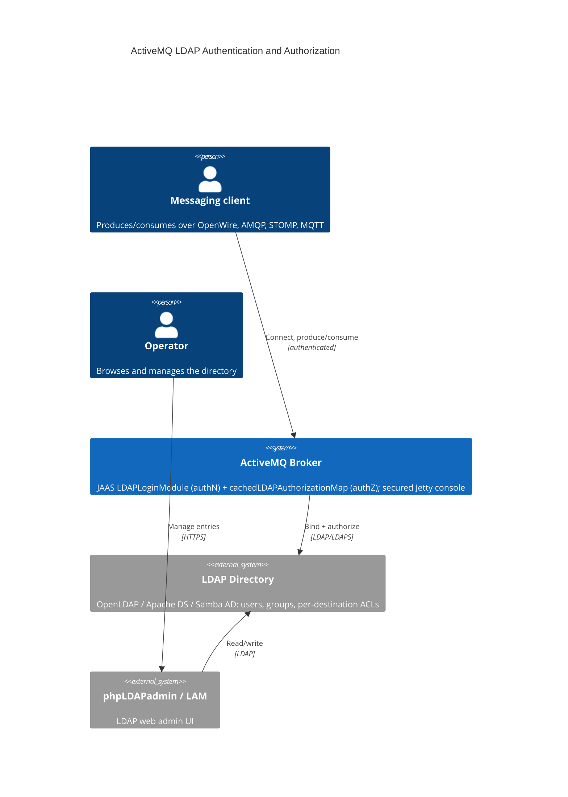

[](https://github.com/AndriyKalashnykov/activemq-ldap-authorization/actions/workflows/ci.yml)
[](https://hits.sh/github.com/AndriyKalashnykov/activemq-ldap-authorization/)
[](https://opensource.org/licenses/MIT)
[](https://app.renovatebot.com/dashboard#github/AndriyKalashnykov/activemq-ldap-authorization)

# ActiveMQ LDAP Authentication and Authorization

Reference demo of delegating **Apache ActiveMQ 6.2.6** authentication and per-destination authorization to LDAP instead of a local user file. The **runtime surface** swaps between three directory backends — OpenLDAP, Apache DS (Microsoft AD mimic), and Samba AD — drives the broker's JAAS `LDAPLoginModule` and `cachedLDAPAuthorizationMap` from env-templated config, and secures the Jetty web console; the **delivery surface** adds a `bats` unit suite for the templating logic, an asserting Docker-Compose e2e (the full authN/authZ matrix), and a GitHub Actions pipeline that builds the four Dockerfiles with a blocking Trivy CVE scan, on Renovate-managed pins.



## Table of Contents

- [Tech Stack](#tech-stack)
- [How it works](#how-it-works)
- [Quick Start](#quick-start)
- [Prerequisites](#prerequisites)
- [Architecture](#architecture)
- [Web consoles](#web-consoles)
- [LDAP backends](#ldap-backends)
- [Verifying authentication & authorization](#verifying-authentication--authorization)
- [Configuration](#configuration)
- [Make targets](#make-targets)
- [CI/CD](#cicd)
- [License](#license)

## Tech Stack

| Component | Technology |
|-----------|------------|
| Message broker | Apache ActiveMQ 6.2.6 (`andriykalashnykov/docker-activemq:6.2.6`) |
| Broker runtime | `eclipse-temurin:25-jre` (Java 25 LTS) |
| Web console auth | Jetty 11.0.26 (bundled with the broker, incl. `jetty-jaas`); JAAS delegated to ActiveMQ's `LDAPLoginModule` |
| Management console | hawtio 5.2.0 on Tomcat 11 / Java 25 (`hawtio/Dockerfile`); LDAP-secured via the **same** `LDAPLogin` realm |
| Directory (default) | OpenLDAP — Symas-built (`openldap/Dockerfile`, slapd 2.6.x) |
| Directory (AD mimic) | Apache DS — built from `apacheds-ad/Dockerfile` (`eclipse-temurin:25-jre` + the pinned `ldap-server.jar` release) |
| Directory (AD) | Samba AD domain controller — `ubuntu:26.04` base |
| LDAP admin UI | phpLDAPadmin — `phpldapadmin/phpldapadmin:2.3.11` (maintained leenooks v2; HTTP on :8080) |
| LDAP account manager | LAM — `ghcr.io/ldapaccountmanager/lam:9.5` (standalone `openldap/` stack) |
| Orchestration | Docker Compose v2 |

## How it works

ActiveMQ never owns its own user/role database. Two broker plugins, configured in [`6.2.6/conf/activemq.xml`](6.2.6/conf/activemq.xml), delegate to LDAP at runtime:

- **Authentication** — `jaasAuthenticationPlugin` using the `LDAPLogin` realm defined in [`6.2.6/conf/login.config`](6.2.6/conf/login.config) (`org.apache.activemq.jaas.LDAPLoginModule`).
- **Authorization** — `authorizationPlugin` with a `cachedLDAPAuthorizationMap` that reads queue/topic/temp permissions from LDAP group entries and refreshes them on an interval.
- **Web console** — the Jetty admin console ([`6.2.6/conf/jetty.xml`](6.2.6/conf/jetty.xml)) authenticates against the **same** `LDAPLogin` realm via a `JAASLoginService`; LDAP group `cn`s map to the `users`/`admins` console roles. Both the broker and the console share one LDAP login module.

The shipped `activemq.xml` and `login.config` are **templates**: they contain `##### PLACEHOLDER #####` tokens that the container entrypoint ([`6.2.6/init.sh`](6.2.6/init.sh)) rewrites from environment variables (`LDAP_HOST`, `LDAP_QUEUE_SEARCH_BASE`, …) at startup. To change the LDAP wiring, set the env vars — never hardcode values into the config files.

## Quick Start

Start the default stack — OpenLDAP + ActiveMQ + phpLDAPadmin:

```bash
make up                       # or: docker compose -f 6.2.6/docker-compose.yml up
```

Then open the [web consoles](#web-consoles). Stop everything with `make down`.

## Prerequisites

- [Docker](https://docs.docker.com/get-docker/)
- [Docker Compose v2](https://docs.docker.com/compose/install/) (`docker compose`)
- `make` (optional, for the convenience targets below)

## Architecture

The [C4 context diagram](#activemq-ldap-authentication-and-authorization) above shows the system boundary. All backends serve the same base DN `dc=activemq,dc=apache,dc=org`:

| Entry | Purpose |
|-------|---------|
| `ou=User,ou=ActiveMQ` | User entries (`uid=admin`, `uid=user`), matched by `(uid={0})` for login |
| `ou=Group,ou=ActiveMQ` | Role groups (`groupOfNames`), matched by `member=uid={1}` |
| `ou=Destination,ou=ActiveMQ` → `ou=Queue` / `ou=Topic` / `ou=Temp` | Authorization entries — group membership grants admin/read/write on destinations |
| `cn=mqbroker,ou=Services,...` | The broker's own bind account |

## Web consoles

| Console | URL | Credentials |
|---------|-----|-------------|
| ActiveMQ admin | http://127.0.0.1:8161/admin/ | login `admin` / password `admin` (LDAP) |
| hawtio | http://localhost:8090/hawtio/ | login `admin` / password `admin` (LDAP); then **Connect** → `http://activemq:8161/api/jolokia` to manage the broker |
| phpLDAPadmin | http://localhost:6443/ | Login DN `cn=admin,dc=activemq,dc=apache,dc=org` / password `admin` |

> The `admin`/`admin` and `user`/`admin` credentials are intentional demo values (the LDIFs store `{SHA}` hashes of `admin`), not secrets.

## LDAP backends

The default stack uses OpenLDAP. Two alternative directory backends are provided:

```bash
# Apache DS (mimics Microsoft AD; LDAP on host port 10389)
cd apacheds-ad && docker compose up

# Samba AD domain controller
cd samba
docker build -t dev-ad -f Dockerfile .
docker run --name dev-ad --hostname ak --privileged -p 636:636 \
  -e SMB_ADMIN_PASSWORD='admin123!' \
  -v "$PWD/:/opt/ad-scripts" -v "$PWD/samba-data:/var/lib/samba" dev-ad
```

For Apache DS, log in to phpLDAPadmin with DN `cn=mqbroker,ou=Services,ou=ActiveMQ,dc=activemq,dc=apache,dc=org` / password `admin`.

## Verifying authentication & authorization

```bash
make test                # bats unit tests for the init.sh config-templating logic
make e2e                 # bring up the stack, assert the LDAP authN/authZ contract, tear down
make e2e-samba           # build + provision the Samba AD DC, assert it serves LDAP, tear down
make e2e-apacheds        # build + run the Apache DS image, assert it serves the AD seed, tear down
make search-openldap     # manual: ldapwhoami + ldapsearch against OpenLDAP (port 389)
make search-apacheds     # manual: same against Apache DS (port 10389)
```

`make e2e` ([`e2e/e2e-test.sh`](e2e/e2e-test.sh)) is the asserting end-to-end test. It composes the OpenLDAP + ActiveMQ stack and verifies, with pass/fail assertions:

- the broker boots and config templating fully resolved (no leftover `##### … #####` placeholders);
- authentication rejects invalid credentials;
- the **authorization matrix** is enforced — `admin` may write `ADMINS.*`, `user` may write `USERS.*`, and `user` is **denied** `ADMINS.*` — exercising the `cachedLDAPAuthorizationMap` rules;
- the LDAP seed (users, groups, memberships) is present.

> The harness waits for the `cachedLDAPAuthorizationMap` to warm up before asserting: immediately after startup the cache is cold (OpenLDAP may still be importing the LDIF) and every producer is transiently denied on the advisory topic. `make e2e` sets a short `LDAP_REFRESH_INTERVAL` so warm-up is fast and deterministic.

## Configuration

Operator-tunable values live in two files (keep version pins in sync between them):

- [`6.2.6/.env`](6.2.6/.env) — consumed by `docker-compose`: LDAP DNs/search bases, ports, JVM/store sizing, log rotation.
- [`scripts/set-env.sh`](scripts/set-env.sh) — consumed by the helper scripts: version pins (`ACTIVEMQ_VER`, `JETTY_VER`), image and container names, and the (commented-out) `DOCKER_LOGIN` / `DOCKER_PWD` DockerHub credentials used by `make push`.

## Make targets

`make help` lists every target. Grouped:

| Target | Description |
|--------|-------------|
| `make help` | List all targets |
| `make deps` / `make deps-act` | Verify local tooling (docker) / install `act` to `~/.local/bin` |
| `make build` | Build the ActiveMQ broker image |
| `make build-samba` | Build the Samba AD domain-controller image |
| `make build-openldap` | Build the OpenLDAP (Symas) image |
| `make build-hawtio` | Build the hawtio console image |
| `make build-apacheds` | Build the Apache DS (AD-mimic) image |
| `make up` / `make down` / `make logs` | Manage the default Compose stack |
| `make lint` | hadolint the Dockerfiles (pinned image) |
| `make mermaid-lint` | Validate the README Mermaid diagram |
| `make static-check` | Composite static gate: `lint` + `mermaid-lint` (the CI `static-check` job) |
| `make test` | Unit tests (bats — config templating) |
| `make e2e` | Bring up stack + assert the LDAP authN/authZ contract |
| `make e2e-samba` | Provision the Samba AD DC + assert it serves LDAP (`--privileged`) |
| `make e2e-apacheds` | Build the Apache DS image + assert it serves the AD-schema seed over LDAP |
| `make scan` | Trivy CVE scan of the built broker image (pinned image) |
| `make push` | Push the broker image (needs `DOCKER_LOGIN` + `DOCKER_PWD` in env) |
| `make search-openldap` / `make search-apacheds` | `ldapsearch` against a running backend |
| `make renovate-validate` | Validate `renovate.json` against the Renovate schema |
| `make clean` | Remove the locally built broker image |
| `make ci` | Local pipeline: static-check + test + build + scan |
| `make ci-run` | Run the act-runnable CI jobs (static-check + test) locally via `act` |

## CI/CD

GitHub Actions ([`CI`](.github/workflows/ci.yml)) runs on every push and pull request to `master`:

| Job | What it does |
|-----|--------------|
| `changes` | `dorny/paths-filter` gate — doc-only changes skip the heavy jobs below while `ci-pass` still goes green |
| `static-check` | `make static-check` — hadolint over the five Dockerfiles + README Mermaid lint |
| `docker` | Matrix-builds the five Dockerfiles (`6.2.6/`, `samba/`, `openldap/`, `hawtio/`, `apacheds-ad/`), each followed by a blocking Trivy CVE scan |
| `test` | `bats` unit tests for the config-templating logic |
| `e2e` | Builds the broker image, composes the OpenLDAP + ActiveMQ stack, and asserts the LDAP authN/authZ matrix (queues + topics) and the Jolokia/console/hawtio logins |
| `e2e-samba` | Provisions the Samba AD domain controller and asserts it serves the AD directory over LDAP (`--privileged`) |
| `e2e-apacheds` | Builds the Apache DS image, runs it with the AD seed, and asserts an authenticated bind reads the Microsoft-schema directory |
| `ci-pass` | Single aggregate status check (`if: always()`) — the one context to require in branch protection / Rulesets |

The Trivy scan is a **blocking gate** (`exit-code: 1`): ActiveMQ 6.2.6 bundles patched Spring 6.2.x (clearing 4 of the 5 EOL CVEs 5.19.6 carried), the dormant `lib/camel` jars and the Canonical `pebble` base binary are removed, and the samba/openldap/apacheds images apt-upgrade their bases (all scan clean). The single residual — `jetty-http` CVE-2026-2332, fixed only in Jetty 12 (6.2.6 bundles Jetty 11) — is documented and waived in [`.trivyignore`](.trivyignore). The gate fails on any new fixable CVE. No repository secrets are required. Dependency pins (Jetty via Maven, the Docker images, the tool images pinned in the `Makefile`, and GitHub Actions) are kept current by [Renovate](https://docs.renovatebot.com/). A weekly [`Cleanup old workflow runs`](.github/workflows/cleanup-runs.yml) workflow prunes old runs and caches.

## License

Released under the [MIT License](LICENSE).
