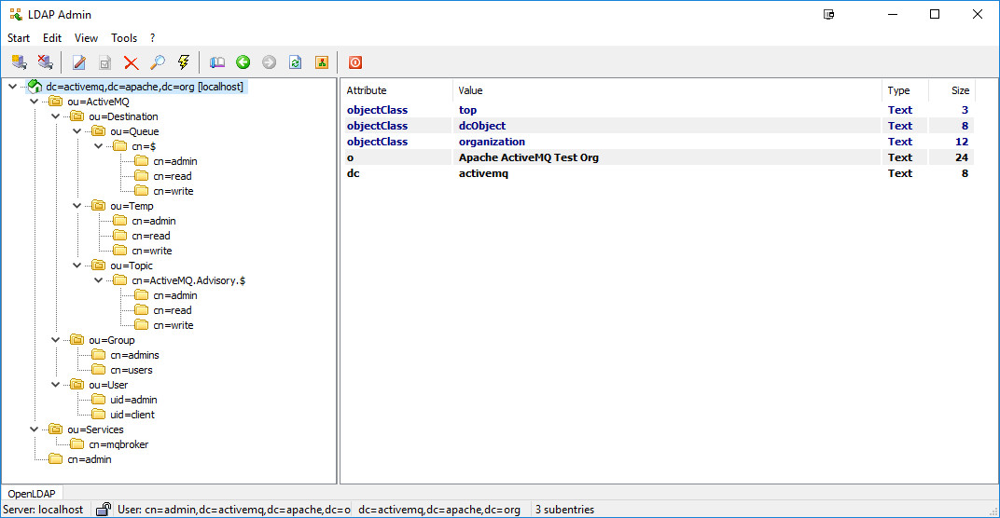

[](https://github.com/AndriyKalashnykov/activemq-ldap-authorization/actions/workflows/docker-image.yml)
[](https://hits.sh/github.com/AndriyKalashnykov/activemq-ldap-authorization/)
[](https://opensource.org/licenses/MIT)

# ActiveMQ LDAP Authentication and Authorization

A runnable demo that delegates **Apache ActiveMQ 5.16.1** authentication and authorization to an LDAP directory instead of a local user file. It ships three interchangeable directory backends — **OpenLDAP**, **Apache DS** (faking Microsoft Active Directory), and **Samba AD** — and also shows how to secure the ActiveMQ Jetty web console. Everything runs as Docker images and `docker-compose` stacks; there is no application source to compile.

## Table of Contents

- [How it works](#how-it-works)
- [Architecture](#architecture)
- [Prerequisites](#prerequisites)
- [Quick Start](#quick-start)
- [Web consoles](#web-consoles)
- [LDAP backends](#ldap-backends)
- [Verifying authentication & authorization](#verifying-authentication--authorization)
- [Make targets](#make-targets)
- [Configuration](#configuration)
- [Tech Stack](#tech-stack)
- [License](#license)

## How it works

ActiveMQ never owns its own user/role database. Two broker plugins, configured in [`5.16.1/conf/activemq.xml`](5.16.1/conf/activemq.xml), delegate to LDAP at runtime:

- **Authentication** — `jaasAuthenticationPlugin` using the `LDAPLogin` realm defined in [`5.16.1/conf/login.config`](5.16.1/conf/login.config) (`org.apache.activemq.jaas.LDAPLoginModule`).
- **Authorization** — `authorizationPlugin` with a `cachedLDAPAuthorizationMap` that reads queue/topic/temp permissions from LDAP group entries and refreshes them on an interval.

The shipped `activemq.xml` and `login.config` are **templates**: they contain `##### PLACEHOLDER #####` tokens that the container entrypoint ([`5.16.1/init.sh`](5.16.1/init.sh)) rewrites from environment variables (`LDAP_HOST`, `LDAP_QUEUE_SEARCH_BASE`, …) at startup. To change the LDAP wiring, set the env vars — never hardcode values into the config files.

## Architecture

<p align="center"></p>

All backends serve the same base DN `dc=activemq,dc=apache,dc=org`:

| Entry | Purpose |
|-------|---------|
| `ou=User,ou=ActiveMQ` | User entries (`uid=admin`, `uid=user`), matched by `(uid={0})` for login |
| `ou=Group,ou=ActiveMQ` | Role groups (`groupOfNames`), matched by `member=uid={1}` |
| `ou=Destination,ou=ActiveMQ` → `ou=Queue` / `ou=Topic` / `ou=Temp` | Authorization entries — group membership grants admin/read/write on destinations |
| `cn=mqbroker,ou=Services,...` | The broker's own bind account |

## Prerequisites

- [Docker](https://docs.docker.com/get-docker/)
- [Docker Compose v2](https://docs.docker.com/compose/install/) (`docker compose`)
- `make` (optional, for the convenience targets below)

## Quick Start

Start the default stack — OpenLDAP + ActiveMQ + phpLDAPadmin:

```bash
make up                       # or: docker compose -f 5.16.1/docker-compose.yml up
```

Then open the [web consoles](#web-consoles). Stop everything with `make down`.

## Web consoles

| Console | URL | Credentials |
|---------|-----|-------------|
| ActiveMQ admin | http://127.0.0.1:8161/admin/ | login `admin` / password `admin` |
| phpLDAPadmin | https://localhost:6443/ | Login DN `cn=admin,dc=activemq,dc=apache,dc=org` / password `admin` |

> The `admin`/`admin` and `user`/`admin` credentials are intentional demo values (the LDIFs store `{SHA}` hashes of `admin`), not secrets.

## LDAP backends

The default stack uses OpenLDAP. Two alternative directory backends are provided:

```bash
# Apache DS (mimics Microsoft AD; LDAP on host port 10389)
cd apacheds-ad && docker compose up

# Samba AD domain controller
cd samba
docker build -t dev-ad -f Dockerfile .
docker run --name dev-ad --hostname ak --privileged -p 636:636 \
  -e SMB_ADMIN_PASSWORD='admin123!' \
  -v "$PWD/:/opt/ad-scripts" -v "$PWD/samba-data:/var/lib/samba" dev-ad
```

For Apache DS, log in to phpLDAPadmin with DN `cn=mqbroker,ou=Services,ou=ActiveMQ,dc=activemq,dc=apache,dc=org` / password `admin`.

## Verifying authentication & authorization

```bash
make search-openldap     # ldapwhoami + ldapsearch against OpenLDAP (port 389)
make search-apacheds     # same against Apache DS (port 10389)
make test                # produce messages as admin/user to allowed & denied destinations
```

`make test` ([`scripts/test-activemq.sh`](scripts/test-activemq.sh)) is the authorization smoke test: it runs the broker's CLI producer as different users against destinations they should and should not be able to write to, exercising the `cachedLDAPAuthorizationMap` rules.

## Make targets

| Target | Description |
|--------|-------------|
| `make help` | List all targets |
| `make build` | Build the ActiveMQ broker image |
| `make build-samba` | Build the Samba AD image |
| `make scan` | Trivy CVE scan of the built broker image |
| `make push` | Push the broker image (needs `DOCKER_LOGIN` + `DOCKER_PWD` in env) |
| `make up` / `make down` / `make logs` | Manage the default Compose stack |
| `make test` | Authorization smoke tests |
| `make ci` | Local pipeline: lint + build + scan |

## Configuration

Operator-tunable values live in two files (keep version pins in sync between them):

- [`5.16.1/.env`](5.16.1/.env) — consumed by `docker-compose`: LDAP DNs/search bases, ports, JVM/store sizing, log rotation.
- [`scripts/set-env.sh`](scripts/set-env.sh) — consumed by the helper scripts: version pins (`ACTIVEMQ_VER`, `JETTY_VER`, `LDAPTIVE_VER`), image and container names, and the (commented-out) `DOCKER_LOGIN` / `DOCKER_PWD` DockerHub credentials used by `make push`.

## Tech Stack

| Component | Technology |
|-----------|------------|
| Message broker | Apache ActiveMQ 5.16.1 (`andriykalashnykov/docker-activemq:5.16.1`) |
| Broker runtime | `eclipse-temurin:8-jre` (Java 8) |
| Web console auth | Jetty 9.4.35 (`jetty-jaas`, `jetty-security`, `jetty-util`) + ldaptive 1.2.4 |
| Directory (default) | OpenLDAP — `osixia/openldap:1.5.0` |
| Directory (AD mimic) | Apache DS — `andriykalashnykov/apacheds-ad` |
| Directory (AD) | Samba AD domain controller — `ubuntu:24.04` base |
| LDAP admin UI | phpLDAPadmin — `osixia/phpldapadmin:0.9.0` |
| Orchestration | Docker Compose v2 |

## License

Released under the [MIT License](LICENSE).
